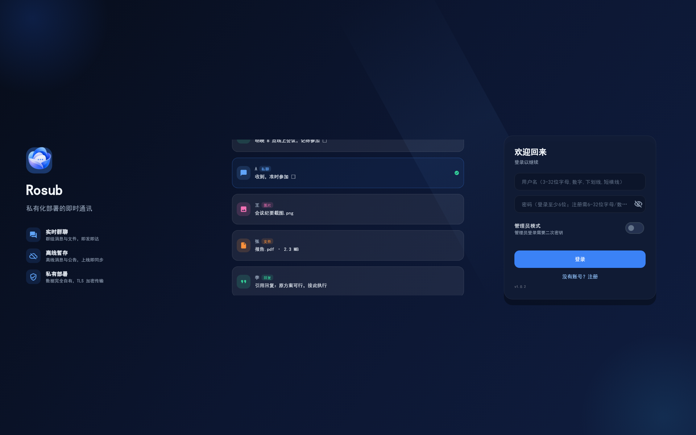
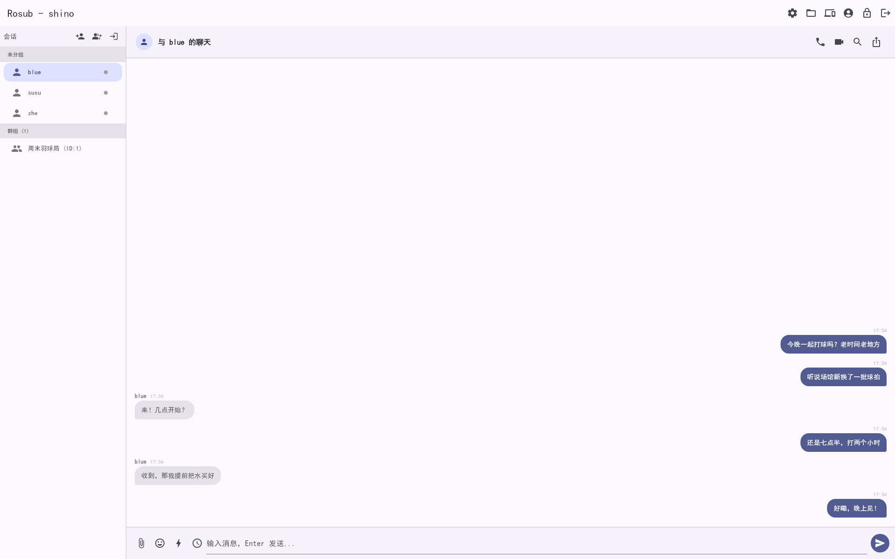
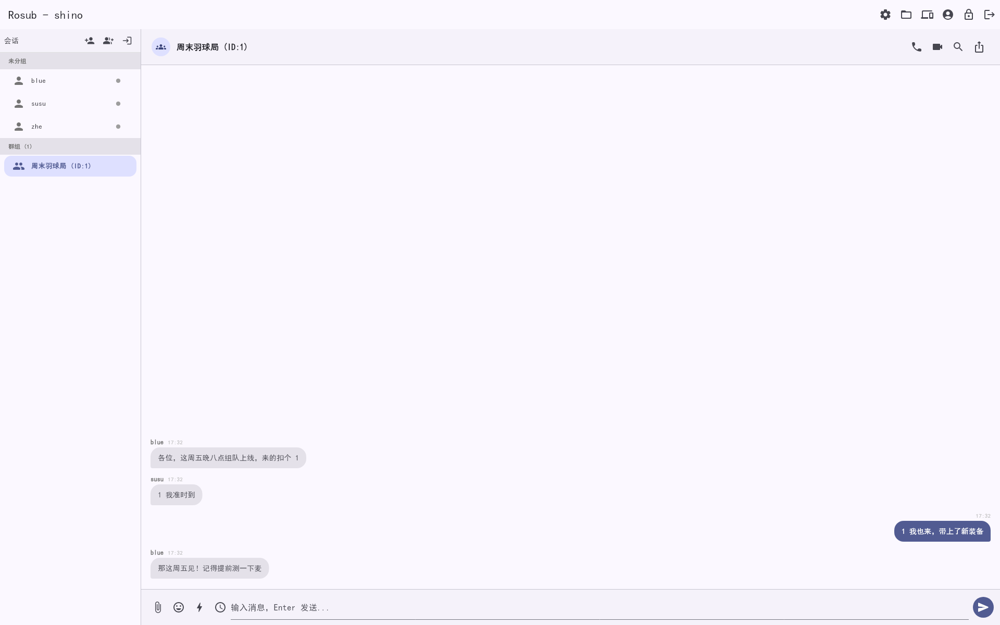

# Rosub · 私有化部署的即时通讯

<p align="center">
  
</p>

<p align="center">
  
  
  
  
</p>

**Rosub** 是一套自研的 C/S 即时通讯系统：Python 多线程服务端 + Flutter 三端客户端（Windows / Linux / Android），自定义二进制协议（v1.0.0 已冻结），数据完全自有。部署在你自己的服务器上，聊天记录、文件、好友关系不经过任何第三方云。

<!-- 🎬 宣传片内嵌占位：在 GitHub 网页编辑本 README，把视频文件拖入下方空行即可自动生成内嵌播放器 -->


https://github.com/user-attachments/assets/cbeb7380-7bae-46e9-8f1d-26ae985a2bce


## 功能一览

| 即时通讯 | 媒体与文件 | 群组治理 | 体验细节 |
|---|---|---|---|
| 私聊 / 群聊（多人多端在线） | 图片粘贴直发 + 拖拽发送 | 群主权限（踢人/转让/改名） | 多公告 / 多置顶 / 点击定位 |
| 离线消息补发 + 重连同步 | 小图片自动接收内联展示 | 入群审批 + 邀请制 | 引用回复 / 转发 / 表情回应 |
| 会话置顶 / 草稿 / 静音免打扰 | 5GB 大文件 + SHA-256 校验 + 断点续传 | 新成员历史可见性 | 定时消息 / 快捷回复 |
| 在线状态 presence | 文件收发管理页 + 传输进度 | 群公告（多公告并存） | 高级消息搜索（条件复合） |
| 好友分组 / 备注名 / 黑名单 | 富媒体气泡 + 文档预览 | 审计日志 | 主题色 / 深色模式 / 中英双语 |
| **1:1 与 6 人群音视频通话**（WebRTC P2P 直连，音视频不经服务器） | 表情包体系 / 图片标注 | 多账号切换 | 消息记录导出（TXT/JSON） |

## 截图

| 登录 | 私聊 | 群聊 |
|---|---|---|
|  |  |  |

## 快速开始

完整 5 分钟路径见 [QUICKSTART.md](QUICKSTART.md)。最短路径：

```bash
# 1) 服务端
python3 -m venv .venv && .venv/bin/pip install -r requirements.txt
.venv/bin/python SSL/gen_cert.py            # 生成自签证书（首次必须）
export CHATROOM_ADMIN_SECRET='任意长随机串'  # 管理员功能需要，普通聊天可省略
.venv/bin/python server/server_main.py       # 监听 127.0.0.1:8090（config.yaml 可改）

# 2) 客户端（另一个终端）
cd chatroom_flutter
flutter pub get
flutter run -d linux                          # 或 -d windows
```

生产部署（systemd、公网安全加固、备份恢复、存储治理）：见 [部署指南.md](部署指南.md)。

## 客户端构建

服务器地址在**编译期**注入（`--dart-define=CHATROOM_SERVER_HOST`，缺省 `127.0.0.1`）：

```bash
cd chatroom_flutter
flutter pub get

# Android（侧载 APK，arm64 单包）
flutter build apk --release --split-per-abi --dart-define=CHATROOM_SERVER_HOST=<你的服务器IP>

# Linux
flutter build linux --release --dart-define=CHATROOM_SERVER_HOST=<你的服务器IP>

# Windows
flutter build windows --release --dart-define=CHATROOM_SERVER_HOST=<你的服务器IP>
```

服务端发行包（零测试/零数据/零密钥）：`scripts/package_server_release.sh <版本号>`。

## 构建要求

- **服务端**：Python ≥ 3.11（依赖仅 bcrypt / pyyaml / cryptography / pyopenssl）
- **Flutter**：3.x stable + Dart 3.x；Android 需 JDK 17
- **Linux 桌面构建**：`build-essential` `cmake` `clang` `ninja-build` `pkg-config` `libgtk-3-dev` `python3-gi`（中文输入法桥）
- **网络要求**：首次构建需访问 GitHub 下载原生制品（libmpv、libwebrtc、sqlite3 native assets）与 jitpack；国内环境请自备代理或使用镜像，如 `PUB_HOSTED_URL=https://pub.flutter-io.cn`、`FLUTTER_STORAGE_BASE_URL=https://storage.flutter-io.cn`

## 架构速览

```
┌───────────┐   自定义二进制协议    ┌──────────────┐
│  客户端    │  4字节长度+JSON头+消息体 │   服务端      │
│  Flutter  │◄────TCP + TLS───────►│ Python 线程池  │
│  三端      │   v1.0.0 已冻结       │ SQLite 持久化  │
└───────────┘                      └──────────────┘
        │                                   │
        │ WebRTC P2P（音视频流不经服务器）      │ 单端口 8090：信令/消息/大文件同端口
        └────────────── 对端直连 ─────────────┘
```

- **协议**：`protocol.py` / `dart_protocol/` 双端镜像实现，v1.0.0 冻结，向后兼容演进
- **服务端**：thread-per-connection + SSL + SQLite（18 张表），存储治理（过期清理/磁盘预警/备份）
- **通话**：flutter_webrtc mesh 网状直连，服务器仅中继信令；桌面端剔除 H264/H265 黑帧编码的 SDP 净化
- **Linux 中文输入**：GTK IME 桥接（`chatroom_flutter/bridge/`），绕开 Flutter Linux 引擎输入法缺陷

## 测试

```bash
./run_tests.sh --all          # Python 服务端全量（约 90s，pytest-xdist 并行）
cd chatroom_flutter && flutter test   # Flutter 全量
```

测试分层：协议 / 数据库 / 服务端集成 / E2E（真实服务器子进程）/ Hypothesis 状态机 / Flutter widget / 多端真机集成驱动。开发过程契约先行，测试即规格。

## 合规与免责提示

- 本项目仅供学习与技术研究使用，按「现状」提供，完整免责声明见 [LICENSE](LICENSE)。
- 部署本软件即成为所部署服务器的运营者，须自行遵守服务器所在地法律法规。若在中国大陆境内公网部署，以下为一般性信息梳理（非法律意见）：
  1. **ICP 备案**：非经营性互联网信息服务建议依法办理 ICP 备案（《互联网信息服务管理办法》）。
  2. **日志留存**：网络日志依法应留存不少于 6 个月（《网络安全法》第 21 条）；本项目默认日志仅输出控制台与内存环形缓冲，部署时请自行配置持久化。
  3. **用户实名**：提供即时通信服务应要求用户提供真实身份信息（《网络安全法》第 24 条）；本项目未内置实名机制，仅适合熟人小范围部署。
  4. **个人信息保护**：处理个人信息应遵循合法、正当、必要原则并取得同意（《个人信息保护法》）；本项目存储账号资料、消息与审计日志于部署者自控的数据库，运营者应自行承担告知与保护义务。
  5. **内容管理**：发现违法信息应立即停止传输、保存记录并报告（《网络安全法》第 47 条）；服务端内置踢人/删号/公告/审计等治理工具。
  6. **用途边界**：请勿用于经营性服务或向不特定公众提供服务，勿用于代理、绕行网络接入管制等用途。
  7. **注册准入**：注册接口无门槛（知道 IP + 端口即可注册），公网部署请自行限制准入（防火墙来源白名单等）。

第三方组件许可见 [THIRD-PARTY-NOTICES.md](THIRD-PARTY-NOTICES.md)。

## License

[MIT](LICENSE) © 2026 Rosub Contributors
